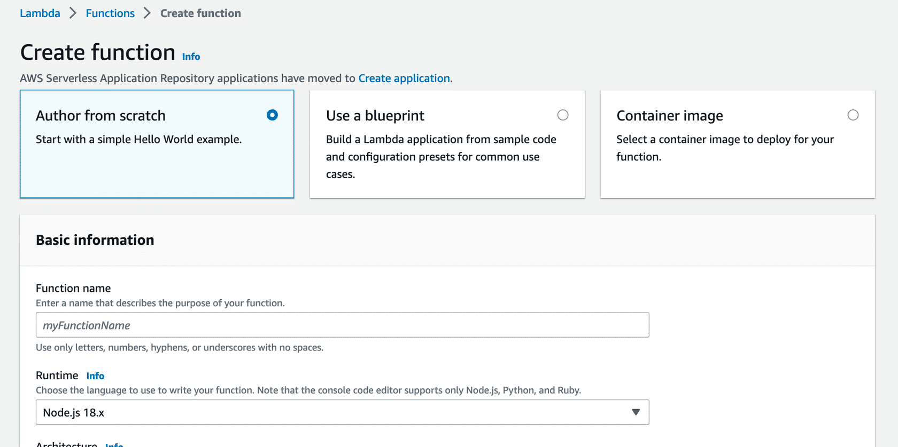

# Serverless with AWS Lambda

With AWS Lambda, there are no servers to manage. You get continuous scaling with subsecond metering and consistent performance.

## <u>I. Running code on AWS Lambda</u>

If you want to deploy your workloads and applications without having to manage any EC2 instances or containers, you can use Lambda.

With Lambda, you can run code without provisioning or managing servers. You can run code for virtually **ANY** type of application or backend service.

Lambda runs your code on a high availability compute infrastructure and requires no administration from the user. You upload your source code in one of the languages that Lambda supports, and Lambda takes care of everything required to run and scale your code with high availability.

## <u>II. How Lambda works</u>

The Lambda function is the foundational principle of AWS Lambda. You can configure it using Lambda console/API, AWS CloudFormation, or AWS Serverless Application Model (SAM). You can invoke your function directly using Lambda API, or configure an AWS service/resource to invoke it in response to an event.

### **Function**

A function is a resource that you can invoke to run your code in Lambda. Lambda runs instances of your function to process events. When you create the Lambda function, it can be authored in several ways:

- You can create the function from scratch.
- You can use a blueprint that AWS provides.
- You can select a container image to deploy for your function.
- You can browse the AWS Serverless Application Repository.



### **Trigger**

Triggers describe when a Lambda function should run. A trigger integrates your Lambda function with other AWS services and event source mappings. So you can run your Lambda function in response to certain API calls or by reading items from a stream or queue. This increases your ability to respond to events in your console without having to perform manual actions.

### **Event**

An event is a JSON-formatted document that contains data for a Lambda function to process. The runtime converts the event to an object and passes it to your function code. When you invoke a function, you determine the structure and contents of the event.

### **Application Environment**

An application environment provides a secure and isolated runtime environment for your Lambda function. An application environment manages the processes and resources that are required to run the function.

### **Deployment package**

You deploy your Lambda function code using a deployment package. Lambda supports two types of deployment packages:

- A .zip file archive – This contains your function code and its dependencies. Lambda provides the operating system and runtime for your function.
- A container image – This is compatible with the Open Container Initiative (OCI) specification. You add your function code and dependencies to the image. You must also include the operating system and a Lambda runtime.

### **Runtime**

The runtime provides a language-specific environment that runs in an application environment. When you create your Lambda function, you specify the runtime that you want your code to run in. You can use built-in runtimes, such as Python, Node.js, Ruby, Go, Java, or .NET Core. Or you can implement your Lambda functions to run on a custom runtime.

### **Lambda function handler**

The AWS Lambda function handler is the method in your function code that processes events. When your function is invoked, Lambda runs the handler method. When the handler exits or returns a response, it becomes available to handle another event.

You can use the following general syntax when creating a function handler in Python.

```
def handler_name (event, context):
...
return some_value
```

## <u>III. Billing granularity</u>

With Lambda, you can run code without provisioning or managing servers, and you pay only for what you use. You are charged for the number of times that your code is invoked (requests) and for the time that your code runs, rounded up to the nearest 1 millisecond (ms) of duration.

AWS rounds up duration to the nearest ms with no minimum run time. With this pricing, it can be cost effective to run functions whose execution time is very low, such as functions with durations under 100 ms or low latency APIs.
