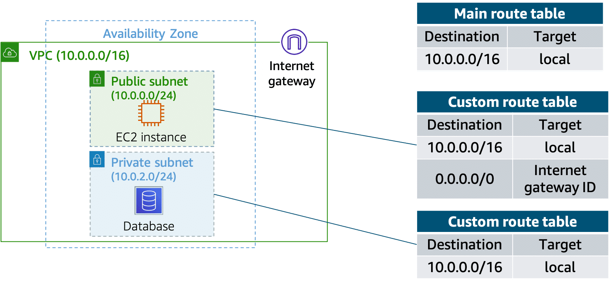

# Amazon VPC Routing

A route table contains a set of rules, called routes, that determine where network traffic from your subnet or gateway is directed.

## <u>I. Main route table</u>

When you create a VPC, AWS creates a route table called the main route table. AWS assumes that when you create a new VPC with subnets, you want traffic to flow between them. Therefore, the default configuration of the main route table is to allow traffic between all subnets in the local network. The following rules apply to the main route table:
- You cannot delete the main route table.
- You cannot set a gateway route table as the main route table.
- You can replace the main route table with a custom subnet route table.
- You can add, remove, and modify routes in the main route table.
- You can explicitly associate a subnet with the main route table, even if it's already implicitly associated.

## <u>II. Custom route tables</u>

The main route table is used implicitly by subnets that do not have an explicit route table association. However, you might want to provide different routes on a per-subnet basis for traffic to access resources outside of the VPC. For example, your application might consist of a frontend and a database. You can create separate subnets for the resources and provide different routes for each of them.

If you associate a subnet with a custom route table, the subnet will use it instead of the main route table. Each custom route table that you create will have the local route already inside it, allowing communication to flow between all resources and subnets inside the VPC. You can protect your VPC by explicitly associating each new subnet with a custom route table and leaving the main route table in its original default state.

