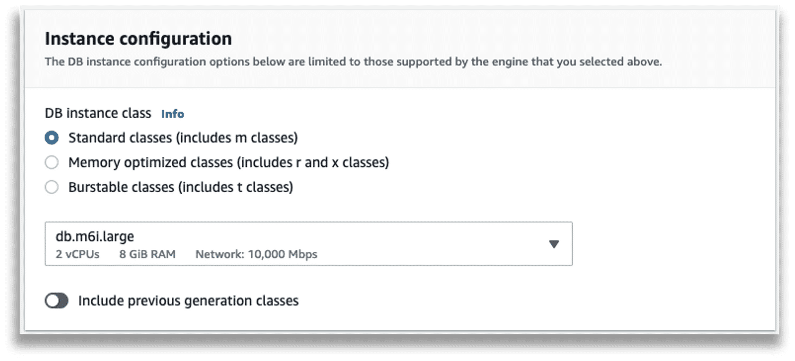
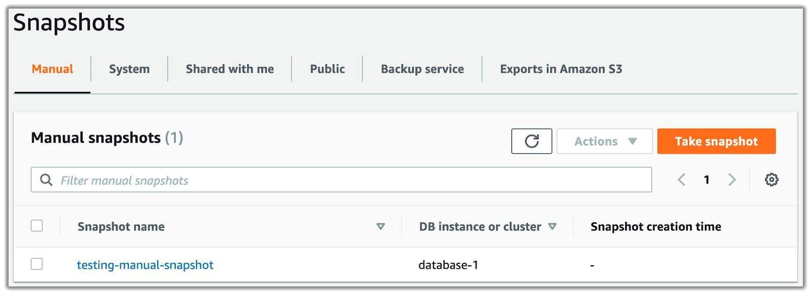
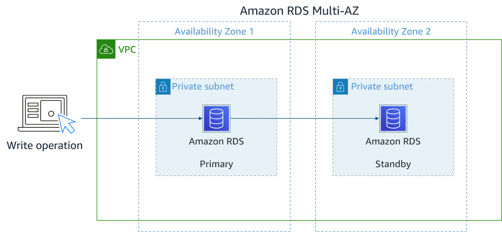

# Amazon RDS

With Amazon Relational Database Service (Amazon RDS), you can focus on tasks that differentiate your application instead of infrastructure-related tasks, like provisioning, patching, scaling, and restoring.

## <u>I. Overview</u>

Amazon Relational Database Service (RDS) is a managed database service customers can use to create and manage relational databases in the cloud without the operational burden of traditional database management.

With Amazon RDS, you can offload some of the unrelated work of creating and managing a database. You can focus on the tasks that differentiate your application, instead of focusing on infrastructure-related tasks, like provisioning, patching, scaling, and restoring.

Amazon RDS supports most of the popular RDBMSs, ranging from commercial options to open-source options and even a specific AWS option. Supported Amazon RDS engines include the following:
- **Commercial**: Oracle, SQL Server
- **Open source**: MySQL, PostgreSQL, MariaDB
- **Cloud native**: Aurora 

## <u>II. Database instances</u>

Just like the databases you build and manage yourself, Amazon RDS is built from compute and storage. The compute portion is called the database (DB) instance, which runs the DB engine. Depending on the engine selected, the instance will have different supported features and configurations. A DB instance can contain multiple databases with the same engine, and each DB can contain multiple tables.

Underneath the DB instance is an EC2 instance. However, this instance is managed through the Amazon RDS console instead of the Amazon EC2 console. When you create your DB instance, you choose the instance type and size. The DB instance class you choose affects how much processing power and memory it has.

- **Standard classes**: Provide a balance of compute, memory, network resources. Good choice for many DB workloads.
- **Memory optimized classes**: Accelerate performance for workloads that process large datasets in memory.
- **Burstable classes**: Provide a baseline level of CPU performance with the ability to burst above the baseline.
- **Amazon RDS instance configuration dropdown menu**: A range of instance configurations with different computational, networking, and memory capacity.

## <u>III. Storage on Amazon RDS</u>

The storage portion of DB instances for Amazon RDS use Amazon Elastic Block Store (Amazon EBS) volumes for database and log storage. This includes MySQL, MariaDB, PostgreSQL, Oracle, and SQL Server. 

When using Aurora, data is stored in cluster volumes, which are single, virtual volumes that use solid-state drives (SSDs). A cluster volume contains copies of your data across three Availability Zones in a single AWS Region. For nonpersistent, temporary files, Aurora uses local storage.

Amazon RDS provides three storage types: General Purpose SSD (also called gp2 and gp3), Provisioned IOPS SSD (also called io1), and Magnetic (also called standard). They differ in performance characteristics and price, which means you can tailor your storage performance and cost to the needs of your database workload.

- **General Purpose SSD**: Offer cost-effective storage. Ideal for a broad range of workloads running on medium-sized DB instances. Best suited for development and testing environments.
- **Provisioned IOPS SSD**: Designed to meet the needs of I/O-intensive workloads. For example, database workloads requiring low I/O latency and consistent I/O throughput. Best suited for production environments.
- **Magnetic**: For backward compatibility. Recommended to use the other two for any new storage needs. The maximum amount of storage for DB instances on magnetic storage is less than that of the other storage types.

## <u>IV. Amazon RDS in an Amazon Virtual Private Cloud</u>

When you create a DB instance, you select the Amazon Virtual Private Cloud (Amazon VPC) your databases will live in. Then, you select the subnets that will be designated for your DB. This is called a DB subnet group, and it has at least two Availability Zones in its Region. The subnets in a DB subnet group should be private, so they don’t have a route to the internet gateway. This ensures that your DB instance, and the data inside it, can be reached only by the application backend.

Access to the DB instance can be restricted further by using network access control lists (network ACLs) and security groups. With these firewalls, you can control, at a granular level, the type of traffic you want to provide access into your database.

Using these controls provides layers of security for your infrastructure. It reinforces that only the backend instances have access to the database.

## <u>V. Backup data</u>

You don’t want to lose your data. To take regular backups of your Amazon RDS instance, you can use automated backups or manual snapshots. To learn about a category, choose the appropriate tab.

- **Automated Backups**: 
    Automated backups are turned on by default. This backs up your entire DB instance (not just individual databases on the instance) and your transaction logs. When you create your DB instance, you set a backup window that is the period of time that automatic backups occur. Typically, you want to set the window during a time when your database experiences little activity because it can cause increased latency and downtime.

    - ***Retaining backups***: Automated backups are retained between 0 and 35 days. You might ask yourself, “Why set automated backups for 0 days?” The 0 days setting stops automated backups from happening. If you set it to 0, it will also delete all existing automated backups. This is not ideal. The benefit of automated backups that you can do point-in-time recovery.
    - **Point-in-time recovery**: This creates a new DB instance using data restored from a specific point in time. This restoration method provides more granularity by restoring the full backup and rolling back transactions up to the specified time range.

    

- **Manual Snapshots**: 
    If you want to keep your automated backups longer than 35 days, use manual snapshots. Manual snapshots are similar to taking Amazon EBS snapshots, except you manage them in the Amazon RDS console. These are backups that you can initiate at any time. They exist until you delete them. For example, to meet a compliance requirement that mandates you to keep database backups for a year, you need to use manual snapshots. If you restore data from a manual snapshot, it creates a new DB instance using the data from the snapshot.

    

### **Choosing a backup option**

It is advisable to deploy both backup options. Automated backups are beneficial for point-in-time recovery. With manual snapshots, you can retain backups for longer than 35 days. 

## <u>VI. Redundancy with Amazon RDS Multi-AZ</u>

In an Amazon RDS Multi-AZ deployment, Amazon RDS creates a redundant copy of your database in another Availability Zone. You end up with two copies of your database—a primary copy in a subnet in one Availability Zone and a standby copy in a subnet in a second Availability Zone.

The primary copy of your database provides access to your data so that applications can query and display the information. The data in the primary copy is synchronously replicated to the standby copy. The standby copy is not considered an active database, and it does not get queried by applications.

To improve availability, Amazon RDS Multi-AZ ensures that you have two copies of your database running and that one of them is in the primary role. If an availability issue arises, such as the primary database loses connectivity, Amazon RDS initiates an automatic failover.

When you create a DB instance, a Domain Name System (DNS) name is provided. AWS uses that DNS name to fail over to the standby database. In an automatic failover, the standby database is promoted to the primary role, and queries are redirected to the new primary database.

To help ensure that you don't lose Multi-AZ configuration, there are two ways you can create a new standby database. They are as follows:

- Demote the previous primary to standby if it's still up and running.
- Stand up a new standby DB instance.

The reason you can select multiple subnets for an Amazon RDS database is because of the Multi-AZ configuration. You will want to ensure that you have subnets in different Availability Zones for your primary and standby copies.

## <u>VII. Amazon RDS security</u>

When it comes to security in Amazon RDS, you have control over managing access to your Amazon RDS resources, such as your databases on a DB instance. How you manage access will depend on the tasks you or other users need to perform in Amazon RDS. Network ACLs and security groups help users dictate the flow of traffic. If you want to restrict the actions and resources others can access, you can use AWS Identity and Access Management (IAM) policies. 

- **IAM**: Assign permissions that determine who can manage RDS resources.
- **Security groups**: Control which IP addressesor EC2 instances can connect to your DBs on a DB instance. When a DB instance is created, all access is prevented except through rules specified by an associated security group.
- **Amazon RDS encryption**: Secure your DB instances and snapshots at rest.
- **Secure Sockets Layer (SSL) or Transport Layer Security (TLS)**: Use this connections with DB instances running the MySQL, MariaDB, PostgreSQL, Oracle, or SQL Server database engines.
