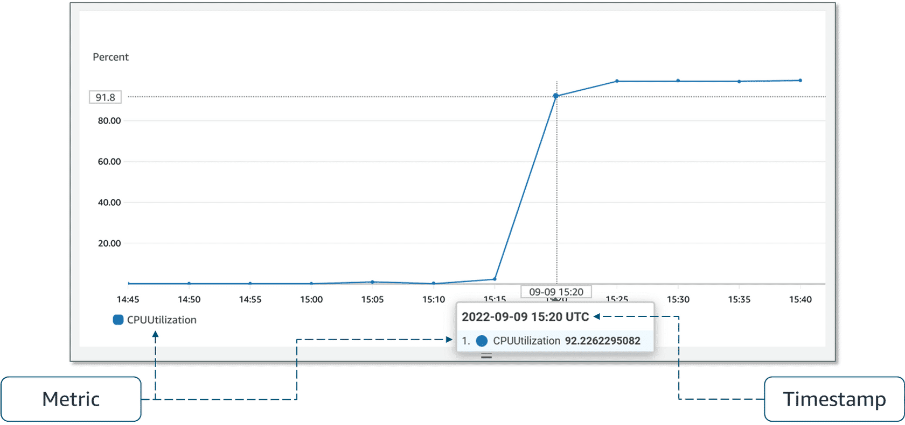
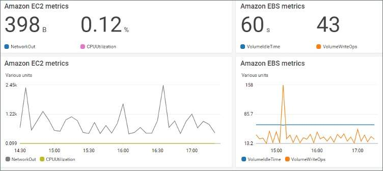
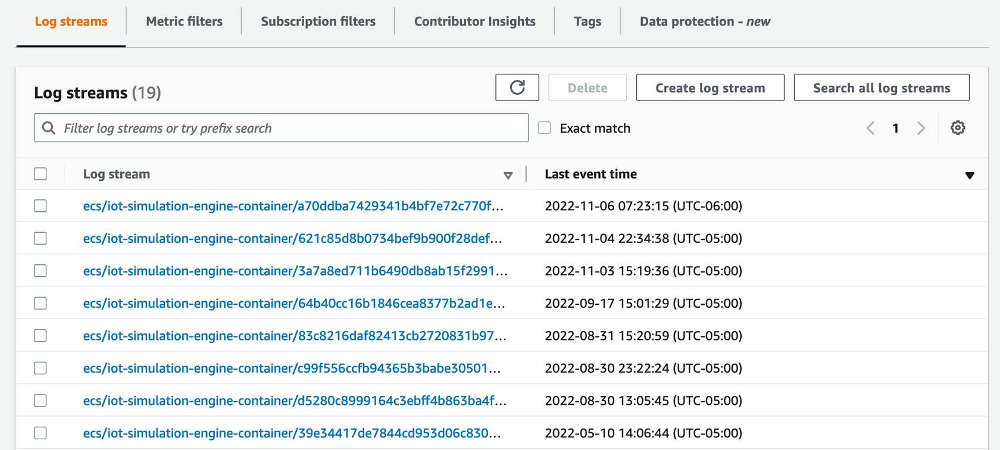
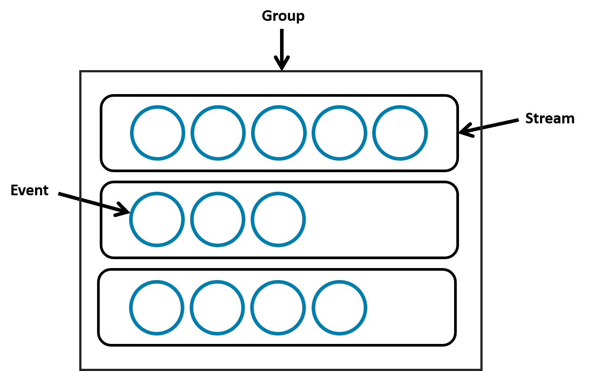

# Amazon CloudWatch

Amazon CloudWatch is a monitoring and observability service that collects your resource data and provides actionable insights into your applications.

## <u>I. Visibility using CloudWatch</u>

AWS resources create data that you can monitor through metrics, logs, network traffic, events, and more. This data comes from components that are distributed in nature. This can lead to difficulty in collecting the data you need if you don’t have a centralized place to review it all. AWS has taken care of centralizing the data collection for you with a service called CloudWatch.

CloudWatch is a monitoring and observability service that collects your resource data and provides actionable insights into your applications. With CloudWatch, you can respond to system-wide performance changes, optimize resource usage, and get a unified view of operational health.

You can use CloudWatch to do the following:
- Detect anomalous behavior in your environments.
- Set alarms to alert you when something is not right.
- Visualize logs and metrics with the AWS Management Console.
- Take automated actions like scaling.
- Troubleshoot issues.
- Discover insights to keep your applications healthy.

## <u>II. How CloudWatch works</u>

With CloudWatch, all you need to get started is an AWS account. It is a managed service that you can use for monitoring without managing the underlying infrastructure.

- **Amazon CloudWatch**: Complete visibility into your cloud resources and applications.
- **Collect**: Collect metrics and logs from your resources, applications, and services that run on AWS or on-premises servers.
- **Monitor**: Visualize applications and infrastructure with dashboards. Troubleshoot with correlated logs and metrics, and set alerts.
- **Act**: Automate responses to operational changes with CloudWatch events and auto scaling.
- **Analyze**: Up to 1-second metrics, extended data retention (15 months), and real-time analysis with CloudWatch metric math.

The employee directory application is built with various AWS services working together as building blocks. Monitoring the individual services independently can be challenging. Fortunately, CloudWatch acts as a centralized place where metrics are gathered and analyzed. 

Many AWS services automatically send metrics to CloudWatch for free at a rate of 1 data point per metric per 5-minute interval. This is called basic monitoring, and it gives you visibility into your systems without any extra cost. For many applications, basic monitoring is adequate.

For applications running on EC2 instances, you can get more granularity by posting metrics every minute instead of every 5-minutes using a feature like detailed monitoring. Detailed monitoring incurs a fee.

## <u>III. CloudWatch concepts</u>

Metrics are the fundamental concept in CloudWatch. A metric represents a time-ordered set of data points that are published to CloudWatch. Think of a metric as a variable to monitor and the data points as representing the values of that variable over time. Every metric data point must be associated with a timestamp.

- **Metric**: Metrics are data about the performance of your systems.
- **Timestamp**: Each metric data point must be associated with a timestamp. If not provided, CloudWatch creates one based on the time the data point was received.

AWS services that send data to CloudWatch attach dimensions to each metric. A dimension is a name and value pair that is part of the metric’s identity. You can use dimensions to filter the results that CloudWatch returns. For example, many Amazon EC2 metrics publish `InstanceId` as a dimension name and the actual instance ID as the value for that dimension.

By default, many AWS services provide metrics at no charge for resources such as EC2 instances, Amazon Elastic Block Store (Amazon EBS) volumes, and Amazon RDS database (DB) instances. For a charge, you can activate features such as detailed monitoring or publishing your own application metrics on resources such as your EC2 instances. 

## <u>IV. Custom metrics</u>

Suppose you have an application, and you want to record the number of page views your website gets. How would you record this metric with CloudWatch? First, it's an application-level metric. That means it’s not something the EC2 instance would post to CloudWatch by default. This is where custom metrics come in. With custom metrics, you can publish your own metrics to CloudWatch.

If you want to gain more granular visibility, you can use high-resolution custom metrics, which make it possible for you to collect custom metrics down to a 1-second resolution. This means you can send 1 data point per second per custom metric.

Some examples of custom metrics include the following:
- Webpage load times
- Request error rates
- Number of processes or threads on your instance
- Amount of work performed by your application

## <u>V. CloudWatch dashboards</u>

Once you provision your AWS resources and they are sending metrics to CloudWatch, you can visualize and review that data using CloudWatch dashboards. Dashboards are customizable home pages you can configure for data visualization for one or more metrics through widgets, such as a graph or text.

You can build many custom dashboards, each one focusing on a distinct view of your environment. You can even pull data from different AWS Regions into a single dashboard to create a global view of your architecture. The following screenshot an example of a dashboard with metrics from Amazon EC2 and Amazon EBS.

CloudWatch aggregates statistics according to the period of time that you specify when creating your graph or requesting your metrics. You can also choose whether your metric widgets display live data. Live data is data published within the last minute that has not been fully aggregated.

You are not bound to using CloudWatch exclusively for all your visualization needs. You can use external or custom tools to ingest and analyze CloudWatch metrics using the GetMetricData API.

As far as security is concerned, with AWS Identity and Access Management (IAM) policies, you control who has access to view or manage your CloudWatch dashboards.

## <u>VI. Amazon CloudWatch Logs</u>

CloudWatch Logs is centralized place for logs to be stored and analyzed. With this service, you can monitor, store, and access your log files from applications running on EC2 instances, AWS Lambda functions, and other sources.

With CloudWatch Logs, you can query and filter your log data. For example, suppose you’re looking into an application logic error for your application. You know that when this error occurs, it will log the stack trace. Because you know it logs the error, you query your logs in CloudWatch Logs to find the stack trace. You also set up metric filters on logs, which turn log data into numerical CloudWatch metrics that you can graph and use on your dashboards.

Some services, like Lambda, are set up to send log data to CloudWatch Logs with minimal effort. With Lambda, all you need to do is give the Lambda function the correct IAM permissions to post logs to CloudWatch Logs. Other services require more configuration. For example, to send your application logs from an EC2 instance into CloudWatch Logs, you need to install and configure the CloudWatch Logs agent on the EC2 instance. With the CloudWatch Logs agent, EC2 instances can automatically send log data to CloudWatch Logs.

## <u>VII. CloudWatch Logs terminology</u>

Log data sent to CloudWatch Logs can come from different sources, so it’s important you understand how they’re organized. 

- **Log event**: A record of activity recorded by the application or resource being monitored. It has a timestamp and an event message.
- **Log stream**: Log events are grouped into log streams, which are sequences of log events that all belong to the same resource being monitored.
- **Log group**: Composed of log streasms that all share the same retention and permissions settings. (You can group log streams from EC2 instances into one log group)

## <u>VIII. CloudWatch alarms</u>

You can create CloudWatch alarms to automatically initiate actions based on sustained state changes of your metrics. You configure when alarms are invoked and the action that is performed.

First, you must decide which metric you want to set up an alarm for, and then you define the threshold that will invoke the alarm. Next, you define the threshold's time period. For example, suppose you want to set up an alarm for an EC2 instance to invoke when the CPU utilization goes over a threshold of 80 percent. You also must specify the time period the CPU utilization is over the threshold. 

You don’t want to invoke an alarm based on short, temporary spikes in the CPU. You only want to invoke an alarm if the CPU is elevated for a sustained amount of time. For example, if CPU utilization exceeds 80 percent for 5 minutes or longer, there might be a resource issue. To set up an alarm you need to choose the metric, threshold, and time period.

An alarm can be invoked when it transitions from one state to another. After an alarm is invoked, it can initiate an action. Actions can be an Amazon EC2 action, an automatic scaling action, or a notification sent to Amazon Simple Notification Service (Amazon SNS).
- **OK**: The metric is within the defined threshold. Everything appears to be operating like normal.
- **ALARM**: The metric is outside the defined threshold. This might be an operational issue.
- **INSUFFICIENT_DATA**: The alarm has just started, the metric is not available, or not enough data is available for the metric to determine the alarm state.

## <u>IX. Prevent and troubleshoot issues with CloudWatch alarms</u>

CloudWatch Logs uses metric filters to turn the log data into metrics that you can graph or set an alarm on. The following timeline indicates the order of the steps to complete when setting up an alarm. It also provides an example using our employee directory application.

### **1. Set up a metric filter**

For the employee directory application, suppose you set up a metric filter for HTTP 500 error response codes. 

### **2. Define an alarm**

Then, you define which metric alarm state should be invoked based on the threshold. With this example, the alarm state is invoked if HTTP 500 error responses are sustained for a specified period of time.

### **3. Define an action**

Next, you define an action that you want to take place when the alarm is invoked. Here, it makes sense to send an email or text alert to you so you can start troubleshooting the website. Hopefully, you can fix it before it becomes a bigger issue.

After the alarm is set up, you know that if the error happens again, you will be notified promptly.

---

You can set up different alarms for different reasons to help you prevent or troubleshoot operational issues. In the scenario just described, the alarm invokes an Amazon SNS notification that goes to a person who looks into the issue manually. 

Another option is to have alarms invoke actions that automatically remediate technical issues. For example, you can set up an alarm to invoke an EC2 instance to reboot or scale services up or down. You can even set up an alarm to invoke an Amazon SNS notification that invokes a Lambda function. The Lambda function then calls any AWS API to manage your resources and troubleshoot operational issues. By using AWS services together like this, you can respond to events more quickly.
