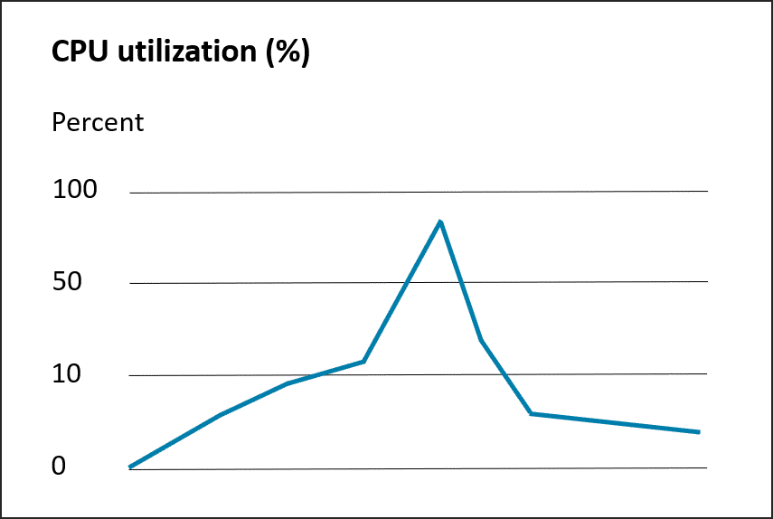

# Monitoring

Monitoring gives you insights into your applications that help you detect, investigate, and remediate problems faster.

## <u>I. Purpose</u>

You need a way to collect and analyze data about the operational health and usage of your resources. The act of collecting, analyzing, and using data to make decisions or answer questions about your IT resources and systems is called monitoring.

Monitoring provides a near real-time pulse on your system and helps answer the previous questions. You can use the data you collect to watch for operational issues caused by events like overuse of resources, application flaws, resource misconfiguration, or security-related events. Think of the data collected through monitoring as outputs of the system, or metrics.

## <u>II. Use metrics to solve problems</u>

The AWS resources that host your solutions create various forms of data that you might be interested in collecting. Each individual data point that a resource creates is a metric. Metrics that are collected and analyzed over time become statistics, such as average CPU utilization over time showing a spike.

One way to evaluate the health of an EC2 instance is through CPU utilization. Generally speaking, if an EC2 instance has a high CPU utilization, it can mean a flood of requests. Or it can reflect a process that has encountered an error and is consuming too much of the CPU. When analyzing CPU utilization, take a process that exceeds a specific threshold for an unusual length of time. Use that abnormal event as a cue to either manually or automatically resolve the issue through actions like scaling the instance.

CPU utilization is one example of a metric. Other examples of metrics that EC2 instances have are network utilization, disk performance, memory utilization, and the logs created by the applications running on top of Amazon EC2.

## <u>III. Types of metrics</u>

- **Amazon S3 metrics**:
  - Size of objects stored in a bucket
  - Number of objects stored in a bucket
  - Number of HTTP request made to a bucket
- **Amazon RDS metrics**:
  - Database connections
  - CPU utilization of an instance
  - Disk space consumption
- **Amazon EC2 metrics**:
  - CPU utilization
  - Network utilization
  - Disk performance
  - Status checks

This is not a complete list of metrics for any of the services mentioned, but you can see how different resources create different metrics. You might be interested in a wide variety of metrics depending on your resources, goals, and questions.

## <u>IV. Monitoring benefits</u>

- **Response proactively**: `Respond to operational issues proactively before your end users are aware of them.` Waiting for end users to let you know when your application is experiencing an outage is a bad practice. Through monitoring, you can keep tabs on metrics like error response rate and request latency. Over time, the metrics help signal when an outage is going to occur. You can automatically or manually perform actions to prevent the outage from happening and fix the problem before your end users are aware of it.
- **Improve performance and reliability**: `Monitoring can improve the performance and reliability of your resources.` Monitoring the various resources that comprise your application provides you with a full picture of how your solution behaves as a system. Monitoring, if done well, can illuminate bottlenecks and inefficient architectures. This helps you drive performance and improve reliability.
- **Recognize security threats and events**: `By monitoring, you can recognize security threats and events.` When you monitor resources, events, and systems over time, you create what is called a baseline. A baseline defines normal activity. Using a baseline, you can spot anomalies like unusual traffic spikes or unusual IP addresses accessing your resources. When an anomaly occurs, an alert can be sent out or an action can be taken to investigate the event.
- **Make data-driven decisions**: `Monitoring helps you make data-driven decisions for your business.` Monitoring keeps an eye on IT operational health and drives business decisions. For example, suppose you launched a new feature for your cat photo app and now you want to know if it’s being used. You can collect application-level metrics and view the number of users who use the new feature. With your findings, you can decide whether to invest more time into improving the new feature.
- **Create cost-effective solutions**: `Through monitoring, you can create more cost-effective solutions.` You can view resources that are underused and rightsize your resources to your usage. This helps you optimize cost and make sure you aren’t spending more money than necessary.
