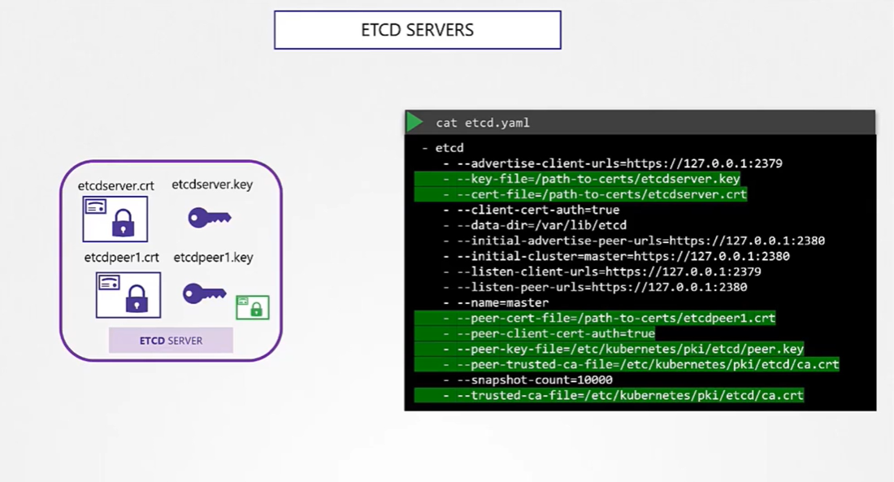
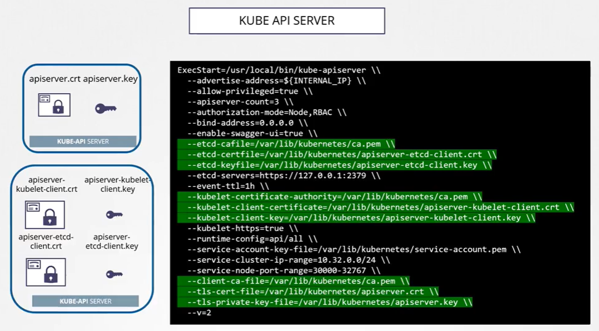
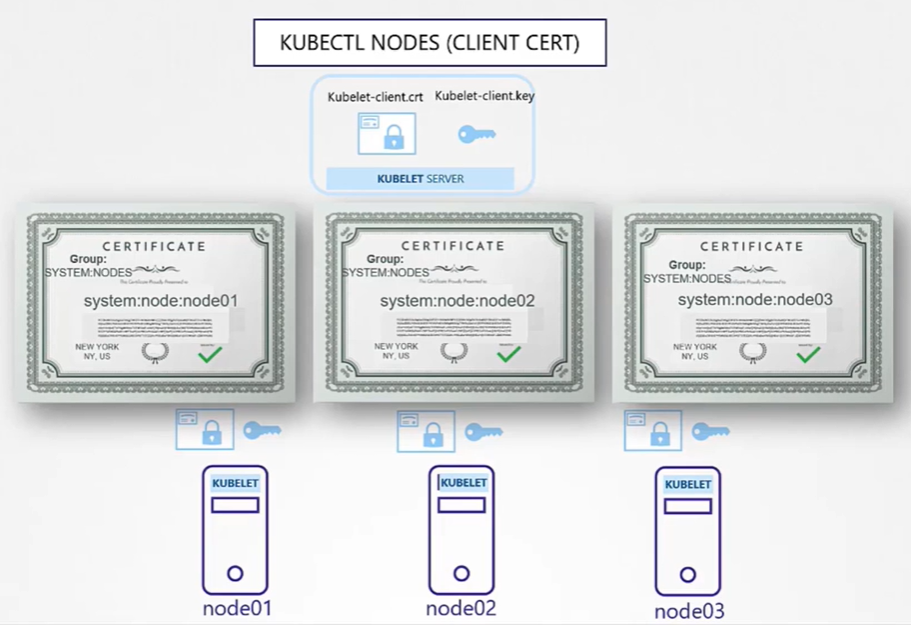
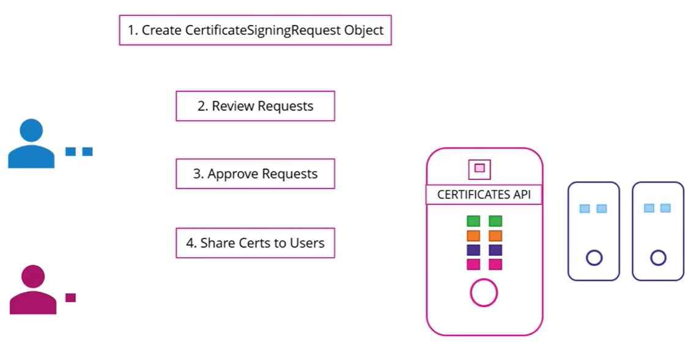

# Kubernetes Security

## Authentication - Who can access?

- Files - username password
- Files - username token
- Certificates
- External service providers (LDAP, etc.)
- Service Accounts (For machines, not users)

## Authorization - What can they do?

- RBAC Authorization
- ABAC Authorization
- Node Authorization
- Webhook Mode

## TLS in Kubernetes

> There also is a pair of keys for Certificate Authority (CA), named `ca.crt` and `ca.key`.


### Certs creation

> The Certificate Name (CN) is for displayed in the audit logs and elsewhere so a relevant name is prefered. <br>
> The `O` in `-subj` is a reference to the group the cert belongs to.

<b>1. Generate CA</b>

```sh
# Generate Keys
openssl genrsa -out ca.key 2048

# Certificate Singing Request
openssl req -new -key ca.key -subj "/CN=KUBERNETES-CA" -out ca.csr

# Sign Certificates
openssl x509 -req -in ca.csr -signkey ca.key -out ca.crt
```

<b>2. Admin User and other clients</b>

```sh
# Generate Keys
openssl genrsa -out admin.key 2048

# Certificate Singing Request
openssl req -new -key admin.key -subj "/CN=kube-admin/O=system:masters" -out admin.csr

# Sign Certificates
openssl x509 -req -in admin.csr -CA ca.crt -CAkey ca.key -out admin.crt
```

> Do these steps for other clients such as Scheduler, Controller-Manager, etc.

<b>3. ETCD Servers</b>

> Following HA best practice, etcd servers might be deployed to multiple clusters. Which is why we need to also create a peer cert and add it as an option in `etcd.yaml`.



<b>4. Kube API Server</b>

> Since `kube-apiserver` is known by many names, it is required to register all the names into the cert.

```conf title="openssl.cnf"
[req]
req_extensions = v3_req
distinguished_name = req_distinguished_name
[ v3_req ]
basicConstraints = CA:FALSE
keyUsage = nonRepudiation,
subjectAltName = @alt_names
[alt_names]
DNS.1 = kubernetes
DNS.2 = kubernetes.default
DNS.3 = kubernetes.default.svc
DNS.4 = kubernetes.default.svc.cluster.local
IP.1 = 10.96.0.1
IP.2 = 172.17.0.87
```

```sh
# Generate Keys
openssl genrsa -out apiserver.key 2048

# Certificate Singing Request
openssl req -new -key apiserver.key -subj "/CN=kube-apiserver" -out apiserver.csr -config openssl.cnf

# Sign Certificates
openssl x509 -req -in apiserver.csr -CA ca.crt -CAkey ca.key -out apiserver.crt
```



<b>5. Kubectl Nodes</b>

> For `kubelet` server cert, we generate cert for each node with the name of the cert set to the name of node. Then we add the cert to `kubelet-config.yaml`.

```yaml title="kubelet-config.yaml"
kind: KubeletConfiguration
apiVersion: kubelet.config.k8s.io/v1beta1
authentication:
  x509:
    clientCAFile: "/var/lib/kubernetes/ca.pem"
authorization:
  mode: Webhook
clusterDomain: "cluster.local"
clusterDNS: 
  - "10.32.0.10"
podCIDR: "${POD_CIDR}"
resolvConf: "/run/systemd/resolve/resolv.conf"
runtimeRequestTimeout: "15m"
tlsCertFile: "/var/lib/kubelet/kubelet-node01.crt"
tlsPrivateKeyFile: "/var/lib/kubelet/kublete-node01.key"
```



### Certificates API



```yaml title="someone-csr.yaml"
apiVersion: certificates.k8s.io/v1beta1
kind: CertificateSigningRequest
metadata:
  name: andqk
spec:
  groups:
    - system:authenticated
  usages:
    - digital signature
    - key encipherment
    - server auth
  request:
    <base64-encoded-csr>
```

```
# View requests
kubectl get csr

# Sign requests
kubectl certificate approve jane

# View request in YAML
kubectl get csr andqk -o yaml
```

## Service Accounts

When create a service account, it will generate a token stored in a secret and mount it the the service account. This token will be used as an authentication `Bearer` token when making REST API call.

For cases when 3rd party apps is deployed inside K8s, the service account token can be mounted directly to the 3rd party app as a volume to be used.

Each ns has its own service account `default`. When a pod is created, this service account is automatically mounted to that pod.

> Since `v1.24`, K8s no longer create service account with a secret token but it has to be done manually. If you want a no expire token, you need to create a secret like below.

```yaml
apiVersion: v1
kind: Secret
type: kubernetes.io/service-account-token
metadata:
  name: mysecret
  annotations:
    kubernetes.io/service-account.name: dashboard-sa
```
