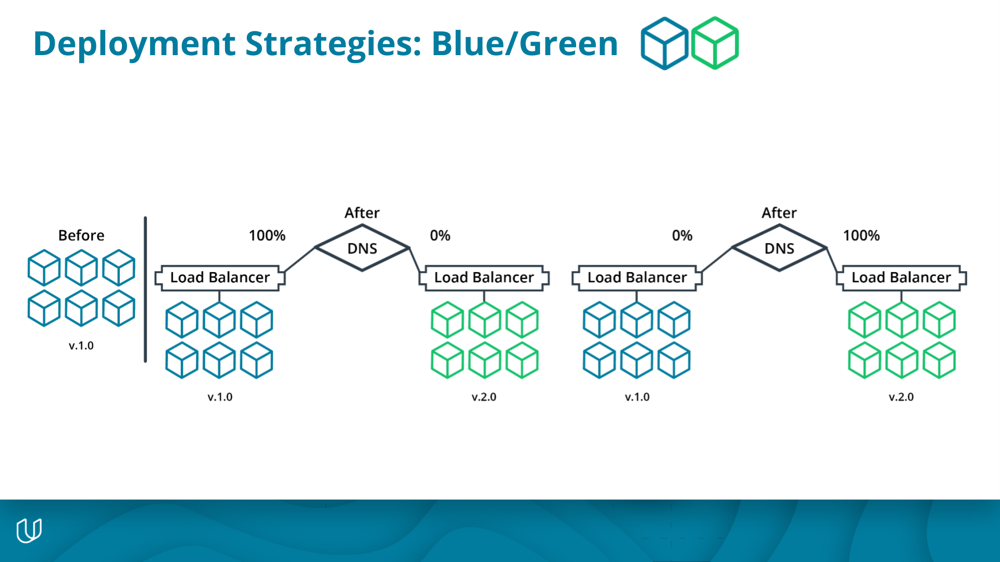

# Blue-green Deployments

A **Blue-green deployment** creates a duplicate (green) environment to deploy the new version of an application. A load balancer may be used to continue to send traffic to the old environment (blue) until the green is ready for usage. After smoke-testing, traffic is routed to the green environment and the blue environment is taken down.

- The deployment creates a completely separate environment for version2 known as the green environment. This environment is logically isolated from version1. During the deployment of version2, 100% of the traffic is still being routed to the blue environment (version1).
- Once all replicas in the green (version2) environment are ready to receive requests, DNS is updated to start serving 100% of requests from the green environment.

The rollback scenario in this deployment is simply to update the DNS to stop serving requests to green (version2) and direct requests to blue (version1).

A Blue-green deployment:

- Is the safest way to deploy an application. It enables zero downtime as the green environment can be tested in isolating before requests are routed to it.
- Allows you to route traffic for a specific subset of users to the new version. Like a Canary deployment, you can opt to only route a percentage of requests to the green environment
- Allows a safe environment to smoke test

Considerations of the Blue-green deployment strategy are:

- It is expensive, as you need to maintain duplicative infrastructure resources.
- The time to deprecate the blue environment can differ depending on how risk-averse the organization is
- Database schema changes could become complex if the different application versions share a database
- Deployment scripts can be complex to account for the additional infrastructure.

This type of deployment is typically used when you have a monolithic application that takes a long time to deploy. This way if you need to roll back, you don’t need to initiate another full deployment, just a simple DNS swap. This strategy is also useful when you want full control over which users have access to the new version.

