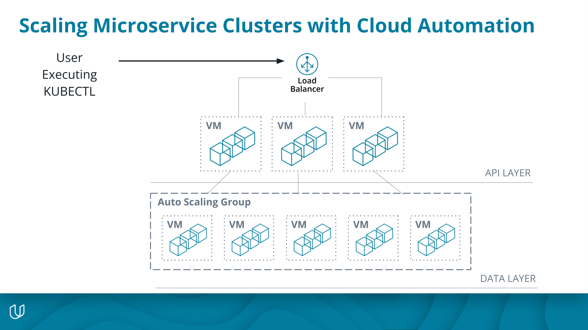

# Scaling Microservice Clusters

A cluster is a logical grouping of VMs used for deploying microservices. Each VM in the cluster is known as a Node which is scaled as part of autoscaling orchestration.

- Autoscaling occurs in the cloud via automation configured in an autoscaling group's launch template.
- This template is a description of the scenarios that initiate a scaling event
- Scaling events may be triggered by resource constraints such as lack of cpu or memory utilization or manual in preparation for future load demands.

The scaling event may be horizontal or vertical, to support the needs of the microservices.

- In the case of a horizontal scaling scenario the autoscaling group will keep the scaling within the bounds defined by the maximum size, and scale-in based on the desired size once the extra replicas are no longer needed.
- In the case of a vertical scaling scenario, the launch template will define what VM types are allowed to be upgraded to.

An example of a microservice cluster is a Kubernetes cluster:

