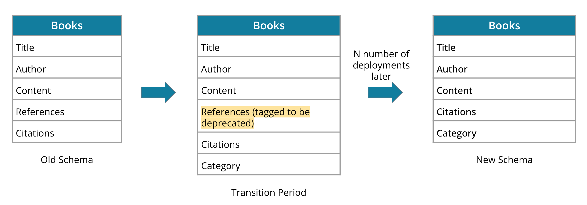

# Rolling Back Deployments

Every deployment strategy has its own way of handling rollbacks, and the need for a rollback will typically occur when:

- Deployment is complete and the application is immediately throwing errors
- During testing of a deployment and it is determined that functionality is broken
- After testing is complete and the business has decided it does not want to continue with the new version.

Every rollback must be assessed critically especially in scenarios that include databases.

- When you roll out a new version, you may have deleted table rows, this will cause a data loss that you cannot recover if you want to roll back.
- In the opposite scenario, you may have added a new table, and after a deployment, it may have been populated with new data when users access the application. This will be lost if you rollback.
- This can lead to a tough decision for a business about when data loss is acceptable and when it isn’t.
- For most organizations, the effort to rollback successfully far outstrips the effort to roll forward with a hotfix to resolve the issue.

The ideal scenario is to roll forward with backward-compatible database changes. Rolling forward with backward-compatible database changes is possible following the **Expand/Contract method**:

- Let's say we have a table called books. In this scenario, we decide that the references column & citations column have duplicate content. So we want to remove the references column and add the categories column while we’re making changes
- The references column is highlighted for future deprecation in 1- 100 deployments later. This number is arbitrary and depends on how risk-averse the business is. Meanwhile, no new data will be written to this column after the first deployment
- The new column `Category`, is added in the first deployment and new data is can be written to it immediately.
- Once the business has backed up the references column data, updated applications to not write to the column, or determined it is no longer useful, this can be removed without fear.

