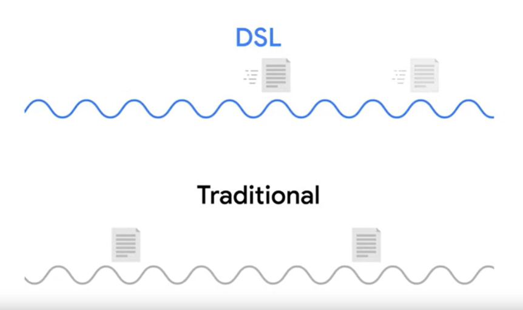

# Digital Subscriber Lines

Twisted pair copper used by modern telephone line can transmit way more data than needed for voice to voice calls. 

> By operating at a frequency range that didn't interfere with normal phone calls, a technology known as digital subscriber line or DSL, was able to send much more data across the wire than traditional dial-up technologies, and to top it all off, this allowed for normal voice phone calls and data transfer to occur at the same time on the same line.

DSL uses its own modems called `DSLAMs or digital subscriber line access multiplexers`.

The connection is generally established when the DSLAM is powered on and isn't torn down until the DSLAM is powered off.

Most 2 common DSL types:
- `ADSL (Asymmetric Digital Subscriber Lines)`:
    Different speed for outbound and incoming data. (Faster download speeds and slower upload speeds - For home use)
- `SDSL (Symmetric Digital Subscriber Lines)`:
    Upload and download speeds are the same.